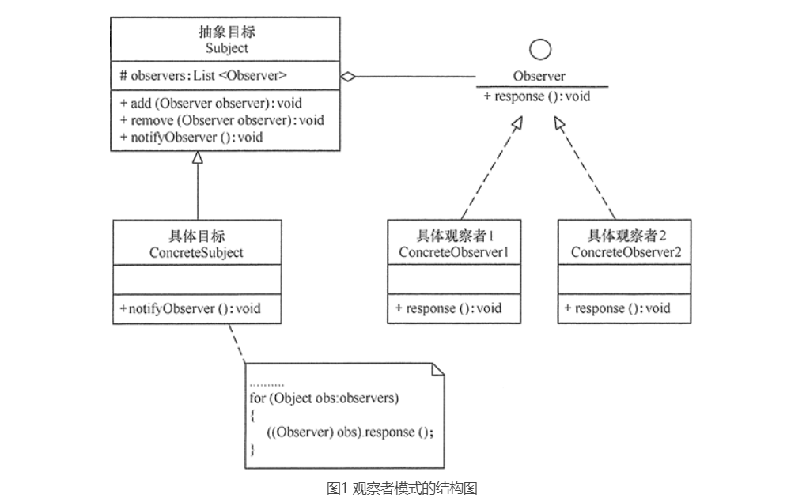
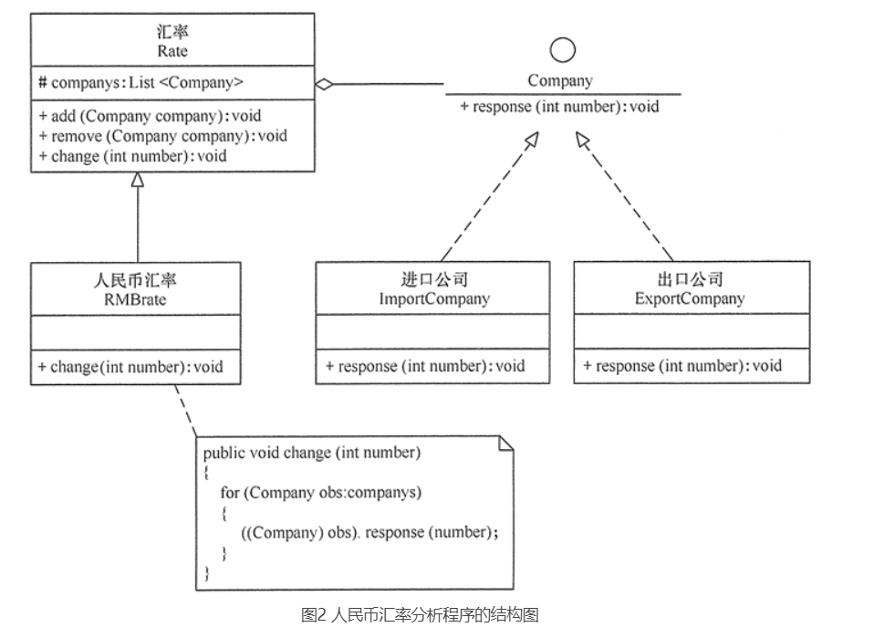

`观察者（Observer）模式的定义：`
    指多个对象间存在一对多的依赖关系，当一个对象的状态发生改变时，所有依赖于它的对象都得到通知并被自动更新。 
这种模式有时又称作发布-订阅模式、模型-视图模式，它是对象行为型模式。

`观察者模式是一种对象行为型模式，其主要优点如下:`
    降低了目标与观察者之间的耦合关系，两者之间是抽象耦合关系。符合依赖倒置原则。
目标与观察者之间建立了一套触发机制。

`它的主要缺点如下:`
    目标与观察者之间的依赖关系并没有完全解除，而且`有可能出现循环引用`,造成系统崩溃。
    当观察者对象很多时，通知的发布会花费很多时间，影响程序的效率。

`观察者模式的主要角色如下。`
抽象主题（Subject）角色：也叫抽象目标类，它提供了一个用于保存观察者对象的聚集类和增加、删除观察者对象的方法，以及通知所有观察者的抽象方法。
具体主题（Concrete Subject）角色：也叫具体目标类，它实现抽象目标中的通知方法，当具体主题的内部状态发生改变时，通知所有注册过的观察者对象。
抽象观察者（Observer）角色：它是一个抽象类或接口，它包含了一个更新自己的抽象方法，当接到具体主题的更改通知时被调用。
具体观察者（Concrete Observer）角色：实现抽象观察者中定义的抽象方法，以便在得到目标的更改通知时更新自身的状态。

例子一的图

