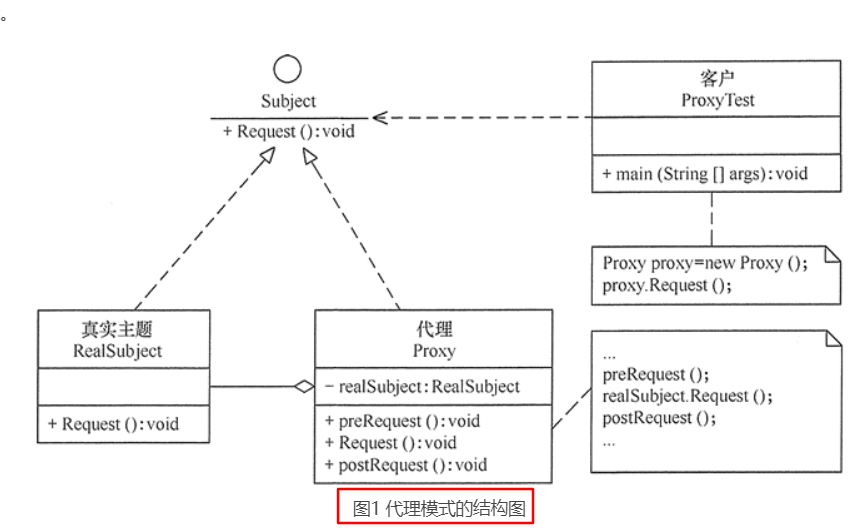
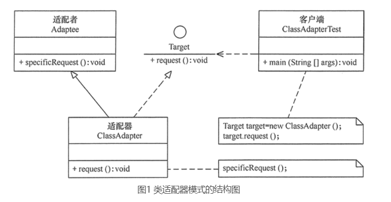
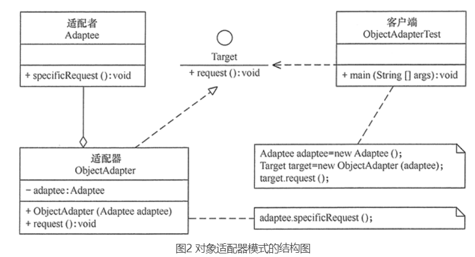

结构型模式描述如何将类或对象按某种布局组成更大的结构。它分为类结构型模式和对象结构型模式，前者采用继承机制来组织接口和类，后者釆用组合或聚合来组合对象。

由于组合关系或聚合关系比继承关系耦合度低，满足“合成复用原则”，所以对象结构型模式比类结构型模式具有更大的灵活性。

结构型模式分为以下 7 种：

一、代理（Proxy）模式：为某对象提供一种代理以控制对该对象的访问。即客户端通过代理间接地访问该对象，从而限制、增强或修改该对象的一些特性。
    1. 模式的结构
    代理模式的主要角色如下。
    抽象主题（Subject）类：通过接口或抽象类声明真实主题和代理对象实现的业务方法。
    真实主题（Real Subject）类：实现了抽象主题中的具体业务，是代理对象所代表的真实对象，是最终要引用的对象。
    代理（Proxy）类：提供了与真实主题相同的接口，其内部含有对真实主题的引用，它可以访问、控制或扩展真实主题的功能。

二、适配器（Adapter）模式：将一个类的接口转换成客户希望的另外一个接口，使得原本由于接口不兼容而不能一起工作的那些类能一起工作。
1. 模式的结构
   适配器模式（Adapter）包含以下主要角色。
   目标（Target）接口：当前系统业务所期待的接口，它可以是抽象类或接口。
   适配者（Adaptee）类：它是被访问和适配的现存组件库中的组件接口。
   适配器（Adapter）类：它是一个转换器，通过继承或引用适配者的对象，把适配者接口转换成目标接口，让客户按目标接口的格式访问适配者。
 
   

三、桥接（Bridge）模式：将抽象与实现分离，使它们可以独立变化。它是用组合关系代替继承关系来实现的，从而降低了抽象和实现这两个可变维度的耦合度。
四、装饰（Decorator）模式：动态地给对象增加一些职责，即增加其额外的功能。
五、外观（Facade）模式：为多个复杂的子系统提供一个一致的接口，使这些子系统更加容易被访问。
六、享元（Flyweight）模式：运用共享技术来有效地支持大量细粒度对象的复用。
七、组合（Composite）模式：将对象组合成树状层次结构，使用户对单个对象和组合对象具有一致的访问性。

以上 7 种结构型模式，除了适配器模式分为类结构型模式和对象结构型模式两种，其他的全部属于对象结构型模式